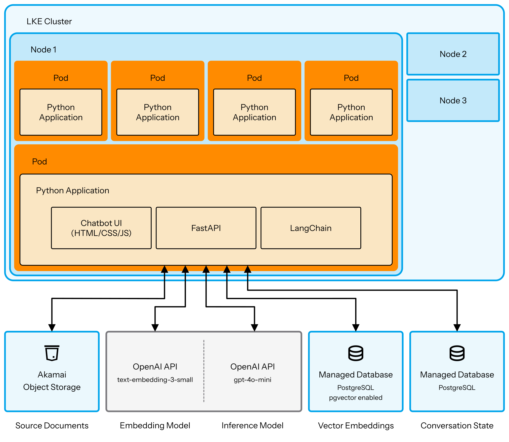

This guide takes the chatbot you built in Guide 1 and deploys it to Linode Kubernetes Engine (LKE). You'll containerize your Python application, create Kubernetes manifests for managing configuration and secrets, and deploy multiple replicas behind a load balancer. While Kubernetes is overkill for a single stateless application with external databases, learning these patterns prepares you for enterprise environments and more complex systems.

Your application code and database schemas remain largely unchanged—the main work involves containerization, understanding stateless pod design, and creating the infrastructure definitions that Kubernetes uses to manage your deployment. By the end, you'll have a production-ready chatbot running on LKE with auto-healing, rolling updates, and horizontal scaling capabilities.

[RAG Chatbot Langchain Compute Instance](/docs/guides/deploy-chatbot-rag-pipeline-langchain-linode)

[RAG Chatbot Langchain Workflow](/docs/guides/using-langchain-create-chatbot-rag-pipeline)

### Prerequisites

Before you begin, make sure you have:

* Completed Guide 1 with a working chatbot deployed on a single Linode via systemd
* Basic Docker knowledge (helpful but not required)
* A Linode account with permissions to manage LKE resources
* [kubectl](https://kubernetes.io/docs/reference/kubectl/introduction/) installed locally
* OpenAI API account and managed PostgreSQL databases provisioned, from Guide 1

### Architecture

Your deployment strategy shifts from a single Linode instance to a distributed container orchestration platform:

* LKE cluster (3+ nodes)
* Multiple containerized app replicas (stateless pods)
* LoadBalancer service for external access
* Same external managed PostgreSQL databases
* Same OpenAI API




### Is Kubernetes necessary for this chatbot?

For a single stateless application with external databases, Kubernetes may be overkill. You could scale Guide 1 horizontally with a few Linode instances behind an [Akamai NodeBalancer](https://techdocs.akamai.com/cloud-computing/docs/nodebalancer).

However, this guide walks you through production Kubernetes patterns valuable for enterprise environments and cloud-native architecture skills that transfer broadly. Even if you don't need Kubernetes today, understanding how to deploy containerized applications prepares you for complex production systems.

## Part 1: Preparing Your Application for Containerization

Your chatbot from Guide 1 has a well-organized structure that's already container-friendly. Refer to that guide or clone the application's [GitHub repository](https://github.com/alvinslee/linode-langchain-rag-chatbot).

```output
PROJECT_ROOT/
├── app/
│   ├── api/
│   │   ├── chat.py
│   │   └── health.py
│   ├── core/
│   │   ├── config.py
│   │   ├── memory.py
│   │   └── rag.py
│   ├── scripts/
│   │   ├── init_db.py
│   │   └── index_documents.py
│   └── main.py
├── requirements.txt
└── .env.template
```

In addition to the application code, you have the following infrastructure already configured from Guide 1:

* **Vector database**: Akamai Managed PostgreSQL instance, with pgvector extension, for storing document embeddings
* **State database**: Separate Akamai Managed PostgreSQL instance, for storing conversation history with LangGraph
* **Object Storage bucket**: Linode Object Storage bucket containing your documents
* **OpenAI API access**: API key for embedding generation (text-embedding-3-small) and chat completions (gpt-4o-mini)

All configuration comes from environment variables in a local copy of .env, which means no hardcoded credentials or paths.

### Understanding stateless pod design

Kubernetes pods are ephemeral—they can be killed and recreated at any time due to node failures, scaling operations, or rolling updates. This means pods must be stateless: they can't store important data locally.

Your chatbot is stateful in that it remembers conversations, but the pods themselves are stateless because all state lives in external PostgreSQL databases:

* **Conversation state** uses the PostgreSQL state database with LangGraph checkpointing.
* **Vector embeddings** are stored in the PostgreSQL vector database, with the help of pgvector.
* **No local file storage**, as all documents are stored in a Linode Object Storage bucket.
* **Configuration** is set via environment variables.

This design means you can destroy any pod without losing data. A replacement pod connects to the same databases and picks up where the previous one left off. Your application code and database schemas from Guide 1 remain unchanged—you're just changing how and where the application runs.

### Audit your configuration

Review the environment variables in your .env file from Guide 1. The following variables will move into Kubernetes Secrets and ConfigMaps, with names remaining the same.

* OPENAI_API_KEY
* VECTOR_DB_URL
* STATE_DB_URL
* LINODE_OBJECT_STORAGE_ACCESS_KEY
* LINODE_OBJECT_STORAGE_SECRET_KEY
* LINODE_OBJECT_STORAGE_ENDPOINT
* LINODE_OBJECT_STORAGE_BUCKET

Ensure that access control for the two managed databases allows for connections from your local machine's IP address. You will be testing your containerized application from your local machine, and this will require connecting to the database.

### Prepare your code repository

In the root folder of your project, create a .dockerignore file to exclude unnecessary files from your Docker image:

```file {title="project/.dockerignore"}
# Python
__pycache__/
*.py[cod]
*$py.class
*.so
.Python

# Virtual environments
venv/
env/
ENV/
.venv

# Environment variables and secrets
.env
.env.local
*.env

# Git
.git/
.gitignore

# Documentation
README.md
*.md

# Logs
*.log

# Temporary files
tmp/
temp/
*.tmp
```

Ensure your requirements.txt is up to date. If you've added dependencies since Guide 1, regenerate it:

```command {title="Regenerate and freeze requirements file"}
(venv) pip freeze > requirements.txt
```

Your application is now ready for containerization.

## Part 2: Containerizing Your Application

Before building your container, understand what you'll create for Kubernetes:

* **Secret**: Stores sensitive data like API keys and database connection strings
* **ConfigMap**: Stores non-sensitive configuration like model names and settings
* **Deployment**: Defines your application pods, replicas, and container specifications
* **Service**: Exposes your application to the internet via a LoadBalancer

Your Python code from Guide 1 requires minimal changes—the main work is containerization and creating these Kubernetes manifests.

### Create your Dockerfile

Create a Dockerfile in your project root folder:

```file {title="project/Dockerfile" lang="dockerfile"}
FROM python:3.11-slim

# Set working directory
WORKDIR /app

# Copy requirements first for layer caching
COPY requirements.txt .

# Install dependencies
RUN pip install --no-cache-dir -r requirements.txt

# Copy application code
COPY app/ ./app/

# Create non-root user for security
RUN useradd -m appuser && chown -R appuser:appuser /app

# Switch to non-root user
USER appuser

# Expose application port
EXPOSE 8000

# Run the application
CMD ["uvicorn", "app.main:app", "--host", "0.0.0.0", "--port", "8000"]
```

This Dockerfile follows container best practices:

* **Slim base image**: Uses [python:3.11-slim](https://hub.docker.com/layers/library/python/3.11-slim) to minimize image size
* **Layer caching**: Copies requirements.txt first so dependency installation is cached
* **Non-root user**: Creates and switches to appuser for security
* **Single process**: Runs uvicorn directly, removing the need for a shell script wrapper

### Build your Docker image locally

Build the image and tag it with a version number:

```command {title="Build Docker image"}
docker build -t langchain-chatbot:1.0.0 ./
```

```output
[+] Building 198.8s (11/11) FINISHED                                                                                                                                                                                                                                  docker:default
 => [internal] load build definition from Dockerfile                   0.0s
 => => transferring dockerfile: 551B                                   0.0s
 => [internal] load metadata for docker.io/library/python:3.11-slim    0.2s
 => [internal] load .dockerignore                                      0.0s
 => => transferring context: 311B                                      0.0s
 => [1/6] FROM docker.io/library/python:3.11-slim@sha256:ff8533f48e12b705fc20d339fde2ec61d0b234dd9366bab3bc84d7b70a45c8c0                                       57.0s …  => [internal] load build context                                      0.0s
 => => transferring context: 1.94kB                                    0.0s
 => [2/6] WORKDIR /app                                                 0.3s
 => [3/6] COPY requirements.txt .                                      0.0s
 => [4/6] RUN pip install --no-cache-dir -r requirements.txt         139.2s
 => [5/6] COPY app/ ./app/                                             0.0s
 => [6/6] RUN useradd -m appuser && chown -R appuser:appuser /app      0.3s
 => exporting to image                                                 1.7s
 => => exporting layers                                                1.7s
 => => writing image sha256:1a935d437430d4c378d81b881c81e28391bcaca452e2bfde229340aa57fa9220 0.0s
 => => naming to docker.io/library/langchain-chatbot:1.0.0
```

### Test your container locally

Before pushing to a registry, verify your container works.

EDITOR: you may need to add your IPv4 address to network allow list of database

```command {title="Run Docker container locally"}
$ docker run --rm \
  -e OPENAI_API_KEY=[REPLACE-WITH-API-KEY] \
  -e VECTOR_DB_URL=[REPLACE-WITH-PSQL-URI] \
  -e STATE_DB_URL=[REPLACE-WITH-PSQL-URI] \
  -e LINODE_OBJECT_STORAGE_ACCESS_KEY=[REPLACE-WITH-ACCESS-KEY] \
  -e LINODE_OBJECT_STORAGE_SECRET_KEY=[REPLACE-WITH-SECRET-KEY] \
  -e LINODE_OBJECT_STORAGE_ENDPOINT=[REPLACE-WITH-ENDPOINT-URL] \
  -e LINODE_OBJECT_STORAGE_BUCKET=[REPLACE-WITH-BUCKET-NAME] \
  -e APP_HOST=0.0.0.0 \
  -e APP_PORT=8000 \
  -e LOG_LEVEL=INFO \
  -p 8000:8000 \
  langchain-chatbot:1.0.0
```

```output
INFO:     Started server process [1]
INFO:     Waiting for application startup.
2025-10-18 15:08:58,440 - app.main - INFO - Starting LangChain RAG Chatbot application
2025-10-18 15:08:58,440 - app.main - INFO - Initializing RAG pipeline...
2025-10-18 15:08:59,902 - app.core.rag - INFO - Vector store initialized successfully
2025-10-18 15:08:59,905 - app.core.rag - INFO - RAG chain created successfully
2025-10-18 15:08:59,905 - app.main - INFO - RAG pipeline initialized successfully
2025-10-18 15:08:59,905 - app.main - INFO - Initializing conversation memory...
2025-10-18 15:08:59,906 - app.core.memory - INFO - Attempting to initialize PostgreSQL checkpointer...
2025-10-18 15:09:00,243 - app.core.memory - INFO - Calling checkpointer.setup()...
2025-10-18 15:09:00,517 - app.core.memory - INFO - PostgreSQL checkpointer schema set up successfully
2025-10-18 15:09:00,517 - app.core.memory - INFO - PostgreSQL checkpointer initialized successfully
2025-10-18 15:09:00,518 - app.core.memory - INFO - Conversation graph created successfully
2025-10-18 15:09:00,519 - app.main - INFO - Conversation memory initialized successfully
2025-10-18 15:09:00,519 - app.main - INFO - Application startup completed successfully
INFO:     Application startup complete.
INFO:     Uvicorn running on http://0.0.0.0:8000 (Press CTRL+C to quit)
```

You can test your container with a curl request to the health check endpoint:

```command {title="Send health check request to containerized application"}
~$ curl localhost:8000/api/health | jq
```

```output
{
    "status": "healthy",
    "vector_db": "connected",
    "state_db": "connected",
    "openai_api": "available",
    "timestamp": "2025-10-11T12:11:08.285338"
}
```

Stop the container with ctrl-C. Your container is ready for deployment.

### Push to container registry

You need a container registry so Kubernetes can pull your image. This guide will use Docker Hub.

Create a Docker Hub account at [https://hub.docker.com](https://hub.docker.com) if you don't have one. Create a repository named langchain-chatbot.

![][image3]

For simplicity, this guide assumes a public repository on Docker Hub. If you create a private repository instead, you'll need to configure image pull secrets in Kubernetes.

Log in to your Docker account from the command line on your local machine.

```command {title="Authenticate with Docker"}
docker login
```

You'll be prompted to open your browser to complete the authentication flow.

```output
USING WEB-BASED LOGIN        Your one-time device confirmation code is: ACDE-FGHI Press ENTER to open your browser or submit your device code here: https://login.docker.com/activate Waiting for authentication in the browser… Login Succeeded
```

On your local machine, tag your image for Docker Hub. Then, push it to the repository.

```command {title="Tag image for Docker Hub"}
docker tag langchain-chatbot:1.0.0 \
  [DOCKER_HUB_USERNAME]/langchain-chatbot:1.0.0
docker push [DOCKER_HUB_USERNAME]/langchain-chatbot:1.0.0
```

```output
The push refers to repository [docker.io/[DOCKER_HUB_USERNAME]/langchain-chatbot]
7f99e52b7e54: Pushed
240b4a608545: Pushed
9dda7ddeb4e1: Pushed
fb91e312c4de: Pushed
ad3453264194: Pushed
b2738b04de4b: Mounted from library/python
dba5cbed1e08: Mounted from library/python
c9cf0647c388: Mounted from library/python
1d46119d249f: Mounted from library/python
1.0.0: digest: sha256:cd3cf4aece1ebb1dcf301446132c586f61011641da94aef69e5a7209aefdbb8b size: 2204
```

## Part 3: Setting Up Your LKE Cluster

With your application containerized and pushed to a registry, you're ready to provision the Kubernetes infrastructure that will run it.

### Create LKE cluster

Create a new Kubernetes cluster in the Akamai Cloud Manager:

1. Navigate to **Kubernetes**. Click **Create Cluster**.
2. Specify a label for your cluster. For example: langchain-chatbot-cluster
3. Select the same region as your managed databases for lower latency.
4. For enabling Akamai App Platform, select **No**.
5. For testing/development, select **No** for the HA Control Plane.
6. Select the Linode instance types to use for your node pool. Choose a type with at least 4GB RAM. Configure the node pool to use at least three nodes.
7. Click **Create Cluster** to submit the request.

![][image4]

Akamai will provision nodes, install Kubernetes, and configure networking. Cluster creation may take several minutes.

![][image5]

### Configure kubectl access

Once your cluster is ready, download the kubeconfig file. In your list of Kubernetes clusters, click **Download Kubeconfig**.

![][image6]

This will download a file (Example: langchain-chatbot-cluster-kubeconfig.yaml) to your local machine. Configure kubectl to use this cluster:

```command {title="Configure kubectl to use cluster's kubeconfig file"}
export KUBECONFIG=[PATH-TO-KUBECONFIG-YAML-FILE]
```

Test your connection with the following command:

```command {title="Use kubectl to get cluster nodes"}
kubectl get nodes
```

```output
NAME                            STATUS   ROLES    AGE  VERSION
lke525573-759963-28d8bdfe0000   Ready    <none>   1m   v1.34.0
lke525573-759963-2db7d3ab0000   Ready    <none>   1m   v1.34.0
lke525573-759963-5b4330b90000   Ready    <none>   1m   v1.34.0
```

You're now connected to your LKE cluster.

### Verify database access from LKE

Your Kubernetes nodes need network access to your managed PostgreSQL databases. [Akamai Cloud documentation](https://techdocs.akamai.com/cloud-computing/docs/aiven-manage-database#lke-and-database-clusters-connectivity) provides this note:

*Each Managed Database cluster in your account automatically updates its ACL every 10 minutes to include the IP address (IPv4 and IPv6) from all LKE nodes in your account, ensuring that newly created, recycled, or auto-scaled nodes can connect to your databases without requiring manual IP access list changes.*

In the Akamai Cloud Manager, take note of the IP addresses for each of the nodes in your Kubernetes cluster. Then, navigate to the two managed databases for your application to verify in network access controls that those IP addresses are included in the allowlist.

Test database connectivity from a temporary pod:

```command {title="Test database connectivity from a pod in a node"}
kubectl run -it \
  --rm debug \
  --image=postgres:18 \
  --restart=Never -- \
  psql [PSQL-CONNECTION-STRING-URI]
```

EDITOR: use connection string like, don't use ssl verification

```
"host=a393531-akamai-prod-137166-default.g2a.akamaidb.net port=12078 user=akmadmin password=PASSWORD dbname=defaultdb"
```

```output
psql (18.0 (Debian 18.0-1.pgdg13+3))
SSL connection (protocol: TLSv1.3, cipher: TLS_AES_256_GCM_SHA384, compression: off, ALPN: postgresql)
Type "help" for help.

defaultdb=>
```

EDITOR: Enter `\q` to quit

Your cluster can now reach your databases.


## Part 4: Creating Kubernetes Manifests

Next, you will create four manifests that tell Kubernetes how to run your application:

1. A [Secret](https://kubernetes.io/docs/concepts/configuration/secret/) for sensitive credentials
2. A [ConfigMap](https://kubernetes.io/docs/concepts/configuration/configmap/) for application settings
3. A [Deployment](https://kubernetes.io/docs/concepts/workloads/controllers/deployment/) to manage your pods
4. A [Service](https://kubernetes.io/docs/concepts/services-networking/service/) to expose them to the internet

### Create Secret for sensitive data

Kubernetes Secrets store sensitive information like API keys and database passwords. Create a file named secret.yaml.

```yaml {title="Secret (secret.yaml) to store sensitive information"}
apiVersion: v1
kind: Secret
metadata:
  name: chatbot-secrets
type: Opaque
stringData:
  openai-api-key: [REPLACE-WITH-API-KEY]
  vector-db-url: [REPLACE-WITH-PSQL-URI]
  state-db-url: [REPLACE-WITH-PSQL-URI]
  linode-object-storage-access-key: [REPLACE-WITH-ACCESS-KEY]
  linode-object-storage-secret-key: [REPLACE-WITH-SECRET-KEY]
```

Although you provide the values in plain text, Kubernetes automatically base64-encodes them when storing. Note that this encoding is for storage format, not security. Anyone with cluster access can retrieve and decode these values.

Never commit secret.yaml with real values to version control. Add it to .gitignore or use a template file with placeholder values.

### Create ConfigMap for non-sensitive configuration

Create configmap.yaml for non-sensitive settings:

```yaml {title="ConfigMap (configmap.yaml) to store non-sensitive settings"}
apiVersion: v1
kind: ConfigMap
metadata:
  name: chatbot-config
data:
  APP_PORT: "8000"
  LLM_MODEL: "gpt-4o-mini"
  EMBEDDING_MODEL: "text-embedding-3-small"
  LINODE_OBJECT_STORAGE_ENDPOINT: [REPLACE-WITH-ENDPOINT-URL]
  LINODE_OBJECT_STORAGE_BUCKET: [REPLACE-WITH-BUCKET-NAME]
```

ConfigMaps separate configuration from code, making it easy to change settings without rebuilding containers.

### Create Deployment manifest

The Deployment defines how Kubernetes runs your application. Create deployment.yaml:

```yaml {title="Deployment (deployment.yaml) manifest"}
apiVersion: apps/v1
kind: Deployment
metadata:
  name: chatbot-deployment
spec:
  replicas: 3
  selector:
    matchLabels:
      app: chatbot
  template:
    metadata:
      labels:
        app: chatbot
    spec:
      containers:
      - name: chatbot
        image: YOUR_DOCKERHUB_USERNAME/langchain-chatbot:1.0.0
        ports:
        - containerPort: 8000
        env:
        - name: OPENAI_API_KEY
          valueFrom:
            secretKeyRef:
              name: chatbot-secrets
              key: openai-api-key
        - name: VECTOR_DB_URL
          valueFrom:
            secretKeyRef:
              name: chatbot-secrets
              key: vector-db-url
        - name: STATE_DB_URL
          valueFrom:
            secretKeyRef:
              name: chatbot-secrets
              key: state-db-url
        - name: LINODE_OBJECT_STORAGE_ACCESS_KEY
          valueFrom:
            secretKeyRef:
              name: chatbot-secrets
              key: linode-object-storage-access-key
        - name: LINODE_OBJECT_STORAGE_SECRET_KEY
          valueFrom:
            secretKeyRef:
              name: chatbot-secrets
              key: linode-object-storage-secret-key
        - name: APP_PORT
          valueFrom:
            configMapKeyRef:
              name: chatbot-config
              key: APP_PORT
        - name: LLM_MODEL
          valueFrom:
            configMapKeyRef:
              name: chatbot-config
              key: LLM_MODEL
        - name: EMBEDDING_MODEL
          valueFrom:
            configMapKeyRef:
              name: chatbot-config
              key: EMBEDDING_MODEL
        - name: LINODE_OBJECT_STORAGE_ENDPOINT
          valueFrom:
            configMapKeyRef:
              name: chatbot-config
              key: LINODE_OBJECT_STORAGE_ENDPOINT
        - name: LINODE_OBJECT_STORAGE_BUCKET
          valueFrom:
            configMapKeyRef:
              name: chatbot-config
              key: LINODE_OBJECT_STORAGE_BUCKET
        resources:
          requests:
            memory: "512Mi"
            cpu: "250m"
          limits:
            memory: "1Gi"
            cpu: "500m"
        livenessProbe:
          httpGet:
            path: /api/health
            port: 8000
          initialDelaySeconds: 30
          periodSeconds: 10
        readinessProbe:
          httpGet:
            path: /api/health
            port: 8000
          initialDelaySeconds: 5
          periodSeconds: 5
```

Note the following key configurations:

* replicas: 3 – Runs three copies of your application for high availability
* resources – Requests guarantee minimum resources; limits cap maximum usage
* livenessProbe – Kubernetes restarts the pod if health checks fail
* readinessProbe – Pod doesn't receive traffic until it's ready
* env – Environment variables populated from Secret and ConfigMap

### Create Service manifest

The Service exposes your application to the internet. Create service.yaml:

```yaml {title="Service (service.yaml) manifest"}
apiVersion: v1
kind: Service
metadata:
  name: chatbot-service
spec:
  type: LoadBalancer
  selector:
    app: chatbot
  ports:
  - protocol: TCP
    port: 80
    targetPort: 8000
```

Setting type: LoadBalancer tells LKE to provision a NodeBalancer that distributes traffic across your pods. The selector matches pods with the label app: chatbot from your Deployment.


## Part 5: Deploying to LKE

With your manifests ready, you'll apply them to your cluster. Each manifest builds on the previous one, so the sequence matters.

### Apply manifests

Deploy your resources in dependency order.

```command {title="Apply Kubernetes manifests"}
kubectl apply -f secret.yaml
kubectl apply -f configmap.yaml
kubectl apply -f deployment.yaml
kubectl apply -f service.yaml
```

```output
secret/chatbot-secrets created configmap/chatbot-config created deployment.apps/chatbot-deployment created service/chatbot-service created
```

Kubernetes now creates your pods and provisions a LoadBalancer.

### Monitor deployment progress

Watch your pods start:

```command {title="Use kubectl to watch status of pods"}
kubectl get pods -w
```

The above command will watch the pods progress from ContainerCreating to Running states.

```output
NAME                                  READY   STATUS    RESTARTS   AGE
chatbot-deployment-598f6cbd78-2n8js   1/1     Running   0          3m31s
chatbot-deployment-598f6cbd78-jj4nz   1/1     Running   0          3m31s
chatbot-deployment-598f6cbd78-p9nnz   1/1     Running   0          3m31s
```

Check detailed pod status, using a specific pod name:

```command {title="Check detailed pod status"}
kubectl describe pod chatbot-deployment-598f6cbd78-2n8js
```

```output
Name:             chatbot-deployment-598f6cbd78-2n8js
Namespace:        default
Priority:         0
Service Account:  default
Node:             lke525573-759963-5b4330b90000/192.168.144.171 Status:           Running
… Containers:
  chatbot:
    Container ID:   containerd://1b0e7cca693b8196fa64e5594e34c5d70d83209cf5e4b82fb9138f518419c9cb
    Image:          [DOCKER-HUB-USERNAME]/langchain-chatbot:1.0.0
    Image ID:       docker.io/[DOCKER-HUB-USERNAME]/langchain-chatbot@sha256:cd3cf4aece1ebb1dcf301446132c586f61011641da94aef69e5a7209aefdbb8b
    Port:           8000/TCP
    Host Port:      0/TCP
    State:          Running
    Ready:          True
    Restart Count:  0
    Limits:
      cpu:     500m
      memory:  1Gi
    Requests:
      cpu:      250m
      memory:   512Mi
    Liveness:   http-get http://:8000/api/health delay=30s timeout=1s period=10s #success=1 #failure=3
    Readiness:  http-get http://:8000/api/health delay=5s timeout=1s period=5s #success=1 #failure=3
    Environment:
      OPENAI_API_KEY:                    <set to the key 'openai-api-key' in secret 'chatbot-secrets'>                     Optional: false
      VECTOR_DB_URL:                     <set to the key 'vector-db-url' in secret 'chatbot-secrets'>                      Optional: false …
Conditions:
  Type                        Status
  PodReadyToStartContainers   True
  Initialized                 True
  Ready                       True
  ContainersReady             True
  PodScheduled                True
…
```

View application logs:

```command {title="View application logs"}
kubectl logs -l app=chatbot --tail=10
```

```output
INFO:     172.234.232.183:43246 - "GET /api/health HTTP/1.1" 200 OK
2025-10-18 15:50:26,836 - app.api.health - INFO - Performing health check
2025-10-18 15:50:28,186 - httpx - INFO - HTTP Request: POST https://api.openai.com/v1/embeddings "HTTP/1.1 200 OK"
2025-10-18 15:50:28,187 - app.api.health - INFO - Health check completed: healthy
INFO:     172.234.232.183:43262 - "GET /api/health HTTP/1.1" 200 OK
2025-10-18 15:50:31,838 - app.api.health - INFO - Performing health check
2025-10-18 15:50:32,029 - httpx - INFO - HTTP Request: POST https://api.openai.com/v1/embeddings "HTTP/1.1 200 OK"
2025-10-18 15:50:32,029 - app.api.health - INFO - Health check completed: healthy
INFO:     172.234.232.183:43274 - "GET /api/health HTTP/1.1" 200 OK
2025-10-18 15:50:34,002 - app.api.health - INFO - Performing health check
INFO:     172.234.253.68:49118 - "GET /api/health HTTP/1.1" 200 OK
2025-10-18 15:50:25,059 - app.api.health - INFO - Performing health check
2025-10-18 15:50:25,255 - httpx - INFO - HTTP Request: POST https://api.openai.com/v1/embeddings "HTTP/1.1 200 OK"
2025-10-18 15:50:25,256 - app.api.health - INFO - Health check completed: healthy
INFO:     172.234.253.68:49128 - "GET /api/health HTTP/1.1" 200 OK
2025-10-18 15:50:30,059 - app.api.health - INFO - Performing health check
2025-10-18 15:50:30,245 - httpx - INFO - HTTP Request: POST https://api.openai.com/v1/embeddings "HTTP/1.1 200 OK"
2025-10-18 15:50:30,246 - app.api.health - INFO - Health check completed: healthy
INFO:     172.234.253.68:49136 - "GET /api/health HTTP/1.1" 200 OK
2025-10-18 15:50:34,003 - app.api.health - INFO - Performing health check
INFO:     172.234.232.4:38044 - "GET /api/health HTTP/1.1" 200 OK
2025-10-18 15:50:28,758 - app.api.health - INFO - Performing health check
2025-10-18 15:50:29,030 - httpx - INFO - HTTP Request: POST https://api.openai.com/v1/embeddings "HTTP/1.1 200 OK"
2025-10-18 15:50:29,031 - app.api.health - INFO - Health check completed: healthy
INFO:     172.234.232.4:44836 - "GET /api/health HTTP/1.1" 200 OK
2025-10-18 15:50:33,758 - app.api.health - INFO - Performing health check
2025-10-18 15:50:33,948 - httpx - INFO - HTTP Request: POST https://api.openai.com/v1/embeddings "HTTP/1.1 200 OK"
2025-10-18 15:50:33,949 - app.api.health - INFO - Health check completed: healthy
INFO:     172.234.232.4:44844 - "GET /api/health HTTP/1.1" 200 OK
2025-10-18 15:50:34,094 - app.api.health - INFO - Performing health check
```

### Get external IP address

Check your Service for the external IP:

```command {title="Get Service status and external IP"}
kubectl get service chatbot-service
```

```output
NAME             TYPE         CLUSTER-IP    EXTERNAL-IP    PORT(S)      AGE
chatbot-service  LoadBalancer 10.128.98.175 172.238.59.197 80:31116/TCP 4m
```

The LoadBalancer may take 1-2 minutes to provision. If the IP address is not yet available, rerun the command after a few minutes.

LKE has provisioned a NodeBalancer that routes traffic to your pods.

### Verify deployment

Test the health endpoint using the external IP:

```command {title="Test health check endpoint with cluster's external IP"}
curl http://172.238.59.197/api/health | jq
```

```output
{
  "status": "healthy",
  "vector_db": "connected",
  "state_db": "connected",
  "openai_api": "available",
  "timestamp": "2025-10-18T15:55:09.914247"
}
```

Navigate to the external IP address in your browser to access the chatbot.

![][image7]

Your chatbot is live on Kubernetes.

## Part 6: Testing Your Kubernetes Deployment

Your chatbot is running on Kubernetes, but you need to verify it works correctly in this distributed environment. Test the user interface, confirm that load balancing distributes requests across pods, and verify that Kubernetes' self-healing capabilities work as expected.

### Test end-to-end functionality with the LoadBalancer

Your chatbot is distributed across multiple pods, which means any request from any pod should properly route through the LoadBalancer to any available pod. Conversation state should persist, regardless of which pod handles each request. Since all state lives in your external PostgreSQL database, any pod can pick up the conversation seamlessly—this is stateless design in action.

The original HTML interface (app/static/index.html) from Guide 1 has JavaScript fetch calls which use a relative path. For example:

```javascript {title="sendMessage function in app/static/index.html"}
async function sendMessage(message) {
  showTypingIndicator();

  try {
    const response = await fetch('/api/chat', {
      method: 'POST',
      headers: {
        'Content-Type': 'application/json',
      },
      body: JSON.stringify({
        message: message,
        thread_id: threadId
      })
    }); …
```

In a production environment, these paths for fetch calls should use the LoadBalancer's external IP (example: http://172.238.59.197/api/chat). However, for this guide, you can test this by editing a local copy of app/static/index.html. Search for any instances of calls to fetch, and prepend the LoadBalancer IP to the request path. Then, save the file and open the local HTML file directly in your browser.

Test the chat interface. It should continue to behave the same. Refresh the page and continue the conversation to verify persistence works across page loads. This confirms your application works identically whether running on a single server or distributed across multiple pods—a key benefit of stateless design.

### Verify horizontal scaling works

Check how requests distribute across pods. In a terminal window, run the following command to follow specific log messages and show the name of the pod that processed each one:

```command {title="Follow logs and display pod name"}
~/$ kubectl logs \     -l app=chatbot      --follow \     --prefix=true \     | grep "Processing chat message"
```

Then, in the browser window with your local copy of app/static/index.html loaded, send several requests to the chatbot.

The log messages may look like this:

```output
[pod/chatbot-deployment-598f6cbd78-2n8js/chatbot] 2025-10-18 16:00:49,820 - app.api.chat - INFO - Processing chat message: Who is Huck?...
[pod/chatbot-deployment-598f6cbd78-2n8js/chatbot] 2025-10-18 16:00:59,339 - app.api.chat - INFO - Processing chat message: Who is Tom?...
[pod/chatbot-deployment-598f6cbd78-2n8js/chatbot] 2025-10-18 16:01:26,643 - app.api.chat - INFO - Processing chat message: Where does Huck live?...
[pod/chatbot-deployment-598f6cbd78-jj4nz/chatbot] 2025-10-18 16:02:16,633 - app.api.chat - INFO - Processing chat message: Where does Tom live?...
[pod/chatbot-deployment-598f6cbd78-2n8js/chatbot] 2025-10-18 16:02:39,514 - app.api.chat - INFO - Processing chat message: Describe their friendship....
[pod/chatbot-deployment-598f6cbd78-jj4nz/chatbot] 2025-10-18 16:03:01,706 - app.api.chat - INFO - Processing chat message: What questions have I asked so far in this convers...
[pod/chatbot-deployment-598f6cbd78-p9nnz/chatbot] 2025-10-18 16:03:18,521 - app.api.chat - INFO - Processing chat message: Do the two of them have any other friends?...
```

Notice how different requests, all originating from the same HTML page, are being distributed across your pods by the LoadBalancer.

### Test Kubernetes self-healing by deleting a pod

Manually force a pod deletion, using a specific pod name:

```command {title="Delete a pod"}
~/$ kubectl delete pod chatbot-deployment-598f6cbd78-2n8js
```

Immediately check the status of your pods.

```command {title="Get pods"}
~/$ kubectl get pods
```

```output
NAME                                  READY   STATUS    RESTARTS   AGE
chatbot-deployment-598f6cbd78-dxbdw   0/1     Running   0          4s
chatbot-deployment-598f6cbd78-jj4nz   1/1     Running   0          1h
chatbot-deployment-598f6cbd78-p9nnz   1/1     Running   0          1h
```

The Deployment controller automatically creates a replacement. Your Service continues working because the other two pods handle traffic during the replacement.


## Part 7: Production Considerations

When deploying to production, keep in mind the following key considerations:

### Manage secrest securely

Never commit secret.yaml with real values to version control. Consider external secret management tools like HashiCorp Vault. Rotate secrets periodically and use Kubernetes RBAC to restrict access.

### Updating your application

When you make code changes, build a new image with an incremented version. Update deployment.yaml with a new image tag.

Kubernetes performs a rolling update—it creates new pods with the updated image, waits for them to pass readiness checks, then terminates old pods. This provides zero-downtime deployment.

### Scaling your application

Scale manually by changing the replica count. This changes the number of pods (application instances)—not the number of nodes (Linode instances). Your three nodes can run many more than three pods, and Kubernetes distributes them based on available resources.

```command {title="Increase deployment replica count"}
~/$ kubectl scale deployment chatbot-deployment --replicas=8
```

```output
deployment.apps/chatbot-deployment scaled
```

Now, when you run kubectl get pods, you will see:

```output {title="Pod count matches updated replica count"}
NAME                                  READY   STATUS    RESTARTS   AGE
chatbot-deployment-598f6cbd78-dxbdw   1/1     Running   0          9m52s
chatbot-deployment-598f6cbd78-fnqf9   1/1     Running   0          62s
chatbot-deployment-598f6cbd78-jj4nz   1/1     Running   0          1h
chatbot-deployment-598f6cbd78-lbj4m   1/1     Running   0          62s
chatbot-deployment-598f6cbd78-nb4mj   1/1     Running   0          62s
chatbot-deployment-598f6cbd78-p9nnz   1/1     Running   0          1h
chatbot-deployment-598f6cbd78-r2nh6   1/1     Running   0          62s
chatbot-deployment-598f6cbd78-v98hf   1/1     Running   0          62s
```

For automatic scaling based on CPU usage, create a [HorizontalPodAutoscaler](https://kubernetes.io/docs/tasks/run-application/horizontal-pod-autoscale/).

### Monitoring and logging

To check resource usage across nodes and pods, first install the [Kubernetes Metric Server](https://github.com/kubernetes-sigs/metrics-server).

```command {title="Install Metrics Server onto cluster"}
~/$ kubectl apply -f https://github.com/kubernetes-sigs/metrics-server/releases/latest/download/components.yaml
```

Then, after a few minutes, you can run commands to show usage.

```command {title="Show CPU and memory usage per node"}
~/$ kubectl top nodes
```

```output
NAME                            CPU(cores)   CPU(%)   MEMORY(bytes)   MEMORY(%)
lke525573-759963-28d8bdfe0000   116m         5%       1950Mi          50%
lke525573-759963-2db7d3ab0000   105m         5%       2002Mi          52%
lke525573-759963-5b4330b90000   72m          3%       1547Mi          40%
```

```command {title="Show CPU and memory usage per pod"}
~/$ kubectl top pods
```

```output
NAME                                  CPU(cores)   MEMORY(bytes)    chatbot-deployment-598f6cbd78-dxbdw   9m           201Mi            chatbot-deployment-598f6cbd78-fnqf9   9m           195Mi            chatbot-deployment-598f6cbd78-jj4nz   10m          526Mi            chatbot-deployment-598f6cbd78-lbj4m   7m           194Mi            chatbot-deployment-598f6cbd78-nb4mj   9m           195Mi            chatbot-deployment-598f6cbd78-p9nnz   9m           535Mi            chatbot-deployment-598f6cbd78-r2nh6   7m           198Mi            chatbot-deployment-598f6cbd78-v98hf   7m           195Mi
```

For production log management, consider log aggregation tools like the ELK stack (Elasticsearch, Logstash, Kibana) or Grafana Loki. These centralize logs from all pods and provide search and visualization.

### Cost management

Calculate your monthly costs:

* **LKE nodes**: 3 nodes × $X/month (varies by plan)
* **NodeBalancer**: $Y/month
* **Managed databases**: Same as Guide 1
* **Object Storage**: Same as Guide 1

Optimize costs by:

* Right-sizing your node pool (use smaller nodes if resource limits are low).
* Reducing replicas if traffic is low.
* Using the cluster autoscaler to scale nodes down during off-peak hours.

## Conclusion

You've deployed your LangChain chatbot to Kubernetes with multiple replicas, proper secrets management, and production-ready infrastructure. The same application from Guide 1 now runs in a cloud-native environment with auto-healing and horizontal scaling capabilities.

This architecture demonstrates enterprise deployment patterns. Guide 3 will show you the Akamai App Platform, giving you similar infrastructure but with less complexity.

### Troubleshooting

If you encounter issues with **pods not starting** (for example: ImagePullBackOff status), then:

* Verify your image name and tag match what you pushed to Docker Hub.
* Check that the image is publicly accessible or that you've configured image pull [secrets with your Docker Hub credentials](https://kubernetes.io/docs/tasks/configure-pod-container/pull-image-private-registry/).
* Try pulling the image locally with docker pull to confirm it exists.

If **pods are crashing immediately** (for example, CrashLoopBackOff status), then perform the following debugging steps:

* Check the logs with kubectl logs <pod-name>.
* Common causes include missing environment variables, incorrect database connection strings, or application code errors.
* Verify your Secret and ConfigMap are applied correctly.

If you encounter **database connection issues**, run the following checks:

* Confirm both database connection strings in your Secret are correct.
* Check that your LKE node IPs are in the allowed IP list for both managed databases.
* Test direct connectivity with a debug pod running psql.

When you create a Kubernetes Service with type: LoadBalancer on LKE, it automatically [provisions an Akamai NodeBalancer](https://techdocs.akamai.com/cloud-computing/docs/get-started-with-load-balancing-on-an-lke-cluster) behind the scenes—you can see it in Akamai Cloud Manager under NodeBalancers. When checking Service status with kubectl, if the **LoadBalancer is stuck in pending state**, then:

* Note that provisioning typically takes 1-2 minutes.
* If it's stuck longer, check the Akamai Cloud Manager for the NodeBalancer status.
* Verify your LKE cluster has proper permissions and there are no account limits preventing LoadBalancer creation.

If you encounter **health probe failures**, then:

* Verify your health check endpoint (in the case of this guide, /api/health) works by testing it directly with [kubectl port-forward](https://kubernetes.io/docs/reference/kubectl/generated/kubectl_port-forward/) and curl.
* Check initialDelaySeconds in your probe configuration—your application might need more time to start.
* Review pod logs for startup errors.

If you encounter **uneven load distribution**, run the following checks:

* Verify your Service selector matches the pod labels in your Deployment.
* Check that all pods are ready with kubectl get pods.
* Some pods might be failing readiness checks, removing them from the load balancer rotation.

If your overall application encounters **resource exhaustion**, then:

* Check resource usage with kubectl top pods and kubectl top nodes.
* If pods are hitting their limits, then increase the values in your Deployment.
* If nodes are full, then scale up your node pool or use larger nodes.
* Consider implementing the HorizontalPodAutoscaler to handle traffic spikes automatically.

## **Additional Resources**

* Akamai
  * LKE documentation: [https://techdocs.akamai.com/cloud-computing/docs/linode-kubernetes-engine](https://techdocs.akamai.com/cloud-computing/docs/linode-kubernetes-engine)
  * Manage a cluster with kubectl: [https://techdocs.akamai.com/cloud-computing/docs/manage-a-cluster-with-kubectl](https://techdocs.akamai.com/cloud-computing/docs/manage-a-cluster-with-kubectl)
  * Load balancing on LKE: [https://techdocs.akamai.com/cloud-computing/docs/get-started-with-load-balancing-on-an-lke-cluster](https://techdocs.akamai.com/cloud-computing/docs/get-started-with-load-balancing-on-an-lke-cluster)
* Docker
  * .dockerignore files: [https://docs.docker.com/build/concepts/context/#dockerignore-files](https://docs.docker.com/build/concepts/context/#dockerignore-files)
  * Writing a Dockerfile: [https://docs.docker.com/get-started/docker-concepts/building-images/writing-a-dockerfile/](https://docs.docker.com/get-started/docker-concepts/building-images/writing-a-dockerfile/)
  * Build and push your first image to Docker Hub: [https://docs.docker.com/get-started/introduction/build-and-push-first-image/](https://docs.docker.com/get-started/introduction/build-and-push-first-image/)
  * Building best practices: [https://docs.docker.com/build/building/best-practices/](https://docs.docker.com/build/building/best-practices/)
* Kubernetes
  * Official documentation: [https://kubernetes.io/docs/](https://kubernetes.io/docs/)
  * Secret: [https://kubernetes.io/docs/concepts/configuration/secret/](https://kubernetes.io/docs/concepts/configuration/secret/)
  * ConfigMap: [https://kubernetes.io/docs/concepts/configuration/configmap/](https://kubernetes.io/docs/concepts/configuration/configmap/)
  * Deployment: [https://kubernetes.io/docs/concepts/workloads/controllers/deployment/](https://kubernetes.io/docs/concepts/workloads/controllers/deployment/)
  * Service: [https://kubernetes.io/docs/concepts/services-networking/service/](https://kubernetes.io/docs/concepts/services-networking/service/)