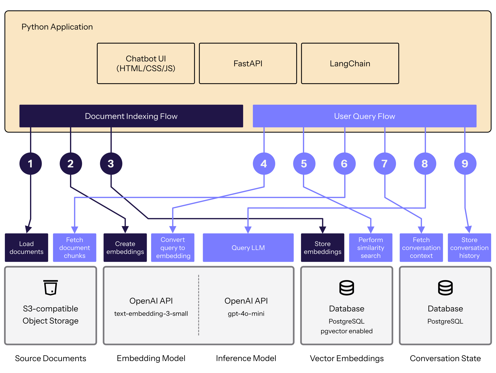

[RAG Chatbot Langchain Compute Instance](/docs/guides/deploy-chatbot-rag-pipeline-langchain-linode)

[RAG Chatbot Langchain LKE](/docs/guides/deploy-chatbot-rag-pipeline-langchain-lke)

Building a chatbot that can answer questions about your specific documents requires solving several problems: processing and indexing documents, generating embeddings, performing vector searches, managing conversation state, and orchestrating LLM interactions. This guide describes how to leverage LangChain and LangGraph, two open-source production-ready frameworks, to simplify chatbot development.

## LangChain vs LangGraph

LangChain offers a comprehensive toolkit for building LLM-powered applications. It provides pre-built integrations with popular vector databases and language models. For retrieval-augmented generation (RAG) chatbots, LangChain includes methods for document loading, text splitting, embedding generation, and the retrieval pipeline. Its *LCEL* expression language lets you chain operations together declaratively, improving the readibility of your chatbot code.

LangGraph orchestrates stateful AI agents. LangGraph provides persistent checkpointing that saves conversation history to a database. This means users can close a chat and resume it later without losing context. LangGraph models conversations as state graphs, where each node represents a processing step (like retrieval or response generation) and edges control the flow. This architecture makes it straightforward to build chatbots that remember context, handle multi-turn conversations, and maintain state across restarts.

## Understanding Retrieval-Augmented Generation (RAG)

Here is a quick overview of how RAG solves the problem of LLMs having limited knowledge of your specific documents. RAG operates in two distinct phases:

1. The **indexing phase** involves preparing your knowledge base: load documents, split them into chunks, generate embeddings, and store everything in your vector database.
2. The **query phase** happens with every user question: convert the question to a vector, find related documents through vector search, and pass that information to the LLM for answer generation.

The key insight is that the retriever uses vector similarity—not the LLM—to find relevant documents. It's pure mathematics comparing embeddings, which makes it fast and cheap. The application involves the LLM only after retrieval, to synthesize information into a natural language answer.

## Workflow Diagram

Below is a high-level diagram of the RAG chatbot architecture deployed on Akamai Cloud Computing.



1.

1.

### Systems and Components

- **Object Storage**: Akamai's S3-compatible object storage used to store source documents that form the chatbot's knowledge base.

- **Vector Database**: Akamai's Managed Database running PostgreSQL with the pgvector extension enabled. Used for storing document embeddings and performing vector similarity searches.

- **State Database**: Akamai's Managed Database running PostgreSQL. Used by LangGraph to persist conversation history across chatbot sessions.

- **Compute Instance**: An Akamai compute instance. Runs the Uvicorn .

- **LangChain**: Open-source framework that orchestrates document processing, embedding generation, vector retrieval, and prompt engineering.

- **LangGraph**: Framework built on LangChain for managing stateful conversations with persistent checkpointing to the state database.

- **FastAPI**: Python web framework providing the REST API endpoints that handle chat requests and responses.

- **OpenAI API**: External LLM service providing both the embedding model (text-embedding-3-small) for document vectorization and the chat model (gpt-4o-mini) for generating responses.

## Chatbot Code Walkthrough

Here is a quick breakdown of the key Python files in the repository:

* app/api/
  * chat.py: Handles chat API endpoints for processing user messages and returning AI responses with conversation thread management.
  * health.py: For monitoring application status, database connectivity, and system health.
* app/core/
  * config.py: Loads environment variables and provides centralized settings for databases, APIs, and application parameters.
  * memory.py: Implements conversation memory persistence across sessions using LangGraph with PostgreSQL checkpointing.
  * rag.py: Core RAG pipeline implementation that handles document indexing from S3-compatible storage, vector storage with pgvector, and query processing.
* app/scripts/
  * init_db.py: Database initialization script that creates necessary PostgreSQL databases, enables the pgvector extension, and sets up the required tables and indexes.
  * index_documents.py: Indexes documents in an object storage bucket by processing them through the RAG pipeline for chunking and embedding, then storing data in the vector database.

### Implementing Document Indexing

Build the pipeline that transforms documents into searchable vectors stored in your PostgreSQL database. The code in scripts/init_db.py handles initializing the conversation and vector databases with the necessary tables and indexes. Run the script with the following command:

Indexing documents involves splitting them into chunks, generating embeddings, and then storing those vectors in the database. These processes are handled in app/core/rag.py. For example:

https://github.com/linode/docs-cloud-projects/blob/rag-pipeline-chatbot-langchain/app/core/rag.py

```file {title="app/core/rag.py", lang="python", linenostart="121", hl_lines=""}
def index_documents_from_s3(self, object_keys: List[str]) -> Dict[str, Any]:
    """
    Index documents from S3-compatible Object Storage.

    Args:
        object_keys: List of object keys in the S3 bucket

    Returns:
        Dictionary with indexing results
    """
    try:
        total_chunks = 0
        processed_docs = 0

        for object_key in object_keys:
            logger.info(f"Processing document: {object_key}")

            # Load document from S3
            loader = S3FileLoader(
                bucket=settings.linode_object_storage_bucket,
                key=object_key,
                aws_access_key_id=settings.linode_object_storage_access_key,
                aws_secret_access_key=settings.linode_object_storage_secret_key,
                endpoint_url=settings.linode_object_storage_endpoint
            )

            documents = loader.load()

            if not documents:
                logger.warning(f"No content found in document: {object_key}")
                continue

            # Split documents into chunks
            text_splitter = RecursiveCharacterTextSplitter(
                chunk_size=settings.chunk_size,
                chunk_overlap=settings.chunk_overlap,
                length_function=len,
                separators=["\n\n", "\n", " ", ""]
            )

            chunks = text_splitter.split_documents(documents)

            # Extract enhanced metadata from document
            enhanced_metadata = self._extract_document_metadata(object_key, documents[0])

            # Log the extracted metadata
            logger.info(f"Extracted metadata for {object_key}:")
            if enhanced_metadata.get("title"):
                logger.info(f"  Title: {enhanced_metadata['title']}")
            if enhanced_metadata.get("author"):
                logger.info(f"  Author: {enhanced_metadata['author']}")
            if enhanced_metadata.get("language"):
                logger.info(f"  Language: {enhanced_metadata['language']}")
            logger.info(f"  Document Type: {enhanced_metadata.get('document_type', 'unknown')}")
            logger.info(f"  Document Length: {enhanced_metadata.get('document_length', 0):,} characters")
            logger.info(f"  Indexed At: {enhanced_metadata.get('indexed_at', 'unknown')}")

            # Add metadata to chunks
            for i, chunk in enumerate(chunks):
                chunk.metadata.update({
                    "source": object_key,
                    "chunk_index": i,
                    "total_chunks": len(chunks),
                    **enhanced_metadata  # Spread enhanced metadata
                })

            # Store chunks in vector database
            self.vector_store.add_documents(chunks)

            total_chunks += len(chunks)
            processed_docs += 1

            logger.info(f"Successfully indexed {len(chunks)} chunks from {object_key}")
            logger.info(f"  Chunk size: {settings.chunk_size} chars, overlap: {settings.chunk_overlap} chars")

        # Create vector index for better performance after all documents are added
        if total_chunks > 0:
            logger.info("Creating vector indexes for better search performance...")
            self._create_vector_index()

        result = {
            "success": True,
            "documents_processed": processed_docs,
            "chunks_created": total_chunks,
            "message": f"Successfully indexed {processed_docs} documents with {total_chunks} chunks"
        }

        logger.info(f"Document indexing completed: {result}")
        return result

    except Exception as e:
        logger.error(f"Failed to index documents: {e}")
        return {
            "success": False,
            "documents_processed": 0,
            "chunks_created": 0,
            "message": f"Failed to index documents: {str(e)}"
        }
```

- S3FileLoader
  - LangChain's document loader for S3-compatible object storage
  - Handles authentication and retrieval of documents from object storage
- RecursiveCharacterTextSplitter (lines 116-121)
  - LangChain's text splitting utility
  - Intelligently splits documents into chunks while:
    - Respecting configurable chunk size (chunk_size)
    - Creating overlaps between chunks (chunk_overlap)
    - Using hierarchical separators (paragraphs → lines → spaces → characters)
- Document objects (line 109)
  - LangChain's standard document format returned by loaders
  - Contains both content and metadata
- Vector store operations (line 143)
  - self.vector_store.add_documents(chunks) - LangChain's abstraction for adding documents to vector databases
  - This would be using something like PGVector (LangChain's PostgreSQL vector store integration)


### Building the RAG query pipeline

The application uses LangChain to chain together the retrieval of relevant document chunks with the LLM-generated response to the user's prompt. In app/core/rag.py, chaining these steps together looks like this:

https://github.com/linode/docs-cloud-projects/blob/rag-pipeline-chatbot-langchain/app/core/rag.py

```python {title="RAG chain, implemented in app/core/rag.py"}
def _create_rag_chain(self):
    """Create the RAG chain for question answering."""
    try:
        # Create retriever
        self.retriever = self.vector_store.as_retriever(
            search_type="similarity",
            search_kwargs={"k": settings.retrieval_k}
        )

        # Define the RAG prompt template
        prompt_template = ChatPromptTemplate.from_messages([
            ("system", """You are a helpful assistant that answers questions based on the provided context.

            Instructions:
            - Answer questions using ONLY the information provided in the context documents
            - Always cite your sources when referencing specific information
            - Include the document title, author, and source file when citing
            - Cite the source file as the original document name, not the chunk index or document number
            - Don't cite the document number (like "Document 1" or "Document 2") as this is not useful information
            - If the context doesn't contain relevant information, say so clearly
            - Be concise but comprehensive in your answers
            - Maintain a helpful and professional tone

            When citing sources, use this format: "According to [Title] by [Author] ([Source file])..." or "As mentioned in [Title] by [Author]..."."""),
            ("human", "Context:\n{context}\n\nQuestion: {question}")
        ])

        # Create the RAG chain using LangChain Expression Language (LCEL)
        self.rag_chain = (
            {"context": self.retriever | self._format_docs, "question": RunnablePassthrough()}
            | prompt_template
            | self.llm
            | StrOutputParser()
        )

        logger.info("RAG chain created successfully")
    except Exception as e:
        logger.error(f"Failed to create RAG chain: {e}")
        raise
```

The above code snippet does the following:

* Configures the [vector store retriever](https://python.langchain.com/docs/how_to/vectorstore_retriever/) to return the top 10 most similar chunks (settings.retrieval_k is defined in app/core/[config.py](http://config.py))
* Designs a [ChatPromptTemplate](https://python.langchain.com/api_reference/core/prompts/langchain_core.prompts.chat.ChatPromptTemplate.html) that instructs the LLM to use the retrieved context and cite sources.
* Uses [LangChain Expression Language (LCEL)](https://python.langchain.com/docs/concepts/lcel/) to invoke the retriever to establish the context for a query, add that context to the prompt, send the enriched prompt to the LLM, and return the LLM's response.

This code snippet uses several LangChain features:

* **Vector Store Retriever** (lines 212-215): Converts the vector store into a retriever interface with `as_retriever()`. The `search_type="similarity"` parameter configures similarity-based vector search, and `search_kwargs={"k": settings.retrieval_k}` returns the top k most similar document chunks.

* **ChatPromptTemplate** (lines 218-233): LangChain's template system for structuring prompts. The `from_messages()` method creates a chat-style prompt with system and human messages, and supports variable interpolation for `{context}` and `{question}`.

* **LangChain Expression Language (LCEL)** (lines 235-241): Uses the pipe operator `|` to chain operations together declaratively. The pipeline executes sequentially: first retrieves context and passes the question through, then formats the prompt template, invokes the LLM, and finally parses the output.

* **RunnablePassthrough** (line 237): A LangChain primitive that passes the input question through unchanged to the prompt template.

* **StrOutputParser** (line 240): LangChain's output parser that extracts string content from the LLM's response object and converts it to plain text.

EDITOR: update LCEL link and maybe highlight it more exactly in the code

### Adding Conversation Memory

To make the RAG system more user-friendly within a chatbot interface, extend it with persistent conversation memory using LangGraph. LangGraph stores conversation history in the conversations database, which enables persistence across restarts and supports multiple concurrent conversations. The checkpointer is implemented in app/core/memory.py:

```python {title="Conversation memory, implemented in app/core/memory.py"}
class ConversationState(TypedDict):
    messages: List[BaseMessage]
    thread_id: str
    user_input: str
    rag_result: Optional[Dict[str, Any]]

class ConversationMemory:
    def __init__(self):
        self.checkpointer = None
        self.graph = None
        self._checkpointer_context = None
        self._initialize_checkpointer()
        self._create_conversation_graph()

    def _create_conversation_graph(self):
        try:
            # Create the graph with state schema
            workflow = StateGraph(ConversationState)

            # Add nodes
            workflow.add_node("rag_query", self._rag_query_node)
            workflow.add_node("generate_response", self._generate_response_node)

            # Define the flow
            workflow.set_entry_point("rag_query")
            workflow.add_edge("rag_query", "generate_response")
            workflow.add_edge("generate_response", END)

            # Compile the graph with checkpointer
            self.graph = workflow.compile(checkpointer=self.checkpointer)

            logger.info("Conversation graph created successfully")
        except Exception as e:
            logger.error(f"Failed to create conversation graph: {e}")
            raise

    def process_message(self, message: str, thread_id: Optional[str] = None) -> Dict[str, Any]:
        try:
            # Generate thread ID if not provided
            if not thread_id:
                thread_id = str(uuid.uuid4())

            # Get existing conversation history first
            existing_history = self.get_conversation_history(thread_id)
            existing_messages = existing_history.get("messages", [])

            # Create human message in serializable format
            human_message = {
                "type": "HumanMessage",
                "content": message,
                "timestamp": datetime.utcnow().isoformat()
            }

            # Prepare initial state with existing messages + new message
            initial_state = {
                "messages": existing_messages + [human_message],
                "thread_id": thread_id,
                "user_input": message,
                "rag_result": None
            }

            # Configure the graph with thread ID
            config = {"configurable": {"thread_id": thread_id}}

            # Run the conversation graph
            final_state = self.graph.invoke(initial_state, config=config)

            # Extract the response
            messages = final_state["messages"]
            ai_response = messages[-1]["content"] if messages else "No response generated."

            result = {
                "response": ai_response,
                "thread_id": thread_id,
                "message_count": len(messages),
                "timestamp": datetime.utcnow().isoformat()
            }

            logger.info(f"Message processed successfully for thread {thread_id}")
            return result

        except Exception as e:
            logger.error(f"Failed to process message: {e}")
            return {
                "response": "I apologize, but I encountered an error while processing your message.",
                "thread_id": thread_id or str(uuid.uuid4()),
                "message_count": 0,
                "timestamp": datetime.utcnow().isoformat(),
                "error": str(e)
            }

     def get_conversation_history(self, thread_id: str) -> Dict[str, Any]:
        try:
            config = {"configurable": {"thread_id": thread_id}}

            # Get the current state
            state = self.graph.get_state(config)

            if not state.values:
                return {
                    "thread_id": thread_id,
                    "messages": [],
                    "created_at": None,
                    "updated_at": None,
                    "message_count": 0
                }

            # Extract messages
            messages = state.values.get("messages", [])

            # Messages are already in serializable format
            formatted_messages = messages if isinstance(messages, list) else []

            # Handle created_at/updated_at timestamps properly             …
            result = {
                "thread_id": thread_id,
                "messages": formatted_messages,
                "created_at": created_at,
                "updated_at": updated_at,
                "message_count": len(formatted_messages)
            }

            logger.info(f"Retrieved conversation history for thread {thread_id}")
            return result

        except Exception as e:
            logger.error(f"Failed to get conversation history: {e}")
            return {
                "thread_id": thread_id,
                "messages": [],
                "created_at": None,
                "updated_at": None,
                "message_count": 0,
                "error": str(e)
            }
```

Every invocation now loads the conversation history as context, executes the RAG chain, and saves the new turn to the database. To verify this implementation works, you would ask a question and then ask a follow-up that requires context.

### Creating the API

The application uses the FastAPI framework to create the web API that clients interact with to send messages and receive responses. The API is implemented in app/api/chat.py. The key endpoint, which accepts messages and returns AI-generated responses, is implemented like this:

```python {title="API endpoint to handle chat messages, in app/api/chat.py"}
import logging
from typing import Dict, Any
from fastapi import APIRouter, HTTPException, Depends
from fastapi.responses import JSONResponse

from app.models.schemas import ChatRequest, ChatResponse
from app.core.memory import get_conversation_memory
from app.core.config import get_settings

logger = logging.getLogger(__name__)
settings = get_settings()

router = APIRouter()

@router.post("/chat", response_model=ChatResponse)
async def chat(
    request: ChatRequest,
    conversation_memory=Depends(get_conversation_memory)
) -> ChatResponse:
    try:
        # Process the message through the conversation memory system
        result = conversation_memory.process_message(
            message=request.message,
            thread_id=request.thread_id
        )

        # Create response
        response = ChatResponse(
            response=result["response"],
            thread_id=result["thread_id"]
        )

        logger.info(f"Chat message processed successfully for thread {result['thread_id']}")
        return response

    except Exception as e:
        logger.error(f"Failed to process chat message: {e}")
        raise HTTPException(
            status_code=500,
            detail=f"Failed to process chat message: {str(e)}"
        )
```

The endpoint accepts a message and an optional thread_id. It generates a new thread_id if none is provided. Then, it invokes the LangGraph RAG chain and returns the final response.

### Creating a Simple HTML Interface

Finally, the chatbot needs a clean UI to make it easily usable. This can be done with a single HTML file with embedded CSS and JavaScript. Key parts of that code include:

```html {title="Chatbot UI in app/static/index.html"}
  <div class="chat-input-container">
            <div class="thread-info" id="threadInfo" style="display: none;">
                <strong>Thread ID:</strong> <span id="threadId"></span>
                <button class="clear-button" onclick="clearConversation()">Clear History</button>
            </div>
            <form class="chat-input-form" id="chatForm">
                <textarea
                    class="chat-input"
                    id="messageInput"
                    placeholder="Type your message here..."
                    rows="1"
                    required
                ></textarea>
                <button type="submit" class="send-button" id="sendButton">Send</button>
            </form>
        </div> …     <script>
        document.addEventListener('DOMContentLoaded', function() {
            initializeApp();
            setupEventListeners();
            checkHealth();
        });

        function initializeApp() {
            // Load thread ID from localStorage or create new one
            threadId = localStorage.getItem('chatbot_thread_id');
            if (threadId) {
                showThreadInfo();
                loadConversationHistory();
            }
        }

        function setupEventListeners() {
            const form = document.getElementById('chatForm');
            const messageInput = document.getElementById('messageInput');

            form.addEventListener('submit', handleSubmit);             …
        }

        function handleSubmit(event) {
            event.preventDefault();

            const messageInput = document.getElementById('messageInput');
            const message = messageInput.value.trim();

            if (!message || isTyping) return;

            // Add user message to chat
            addMessage(message, 'user');

            // Clear input
            messageInput.value = '';
            autoResize();

            // Send message to API
            sendMessage(message);
        }

…
        async function sendMessage(message) {
            try {
                const response = await fetch('/api/chat', {
                    method: 'POST',
                    headers: {
                        'Content-Type': 'application/json',
                    },
                    body: JSON.stringify({
                        message: message,
                        thread_id: threadId
                    })
                });

                if (!response.ok) {
                    throw new Error(`HTTP error! status: ${response.status}`);
                }

                const data = await response.json();

                // Update thread ID if it's new
                if (data.thread_id && data.thread_id !== threadId) {
                    threadId = data.thread_id;
                    localStorage.setItem('chatbot_thread_id', threadId);
                    showThreadInfo();
                }

                // Add assistant response
                addMessage(data.response, 'assistant');

            } catch (error) {
                console.error('Error sending message:', error);
                addMessage('Sorry, I encountered an error while processing your message. Please try again.', 'assistant');
            } finally {
                hideTypingIndicator();
            }
        } …
```